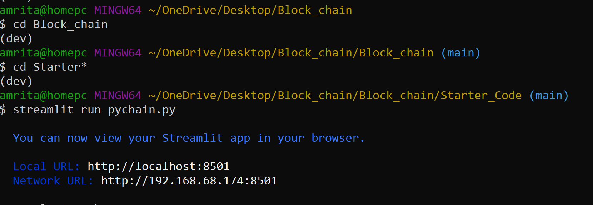
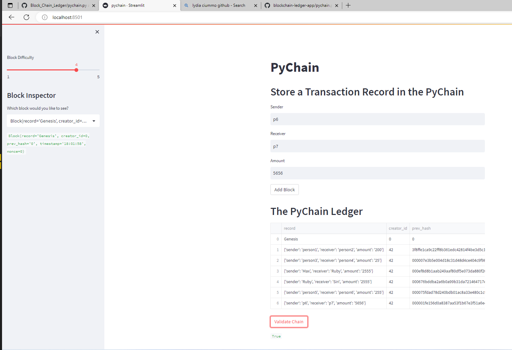

# BlockChain Ledger

This repo is to create a user-friendly web interface using Streamlit to build a blockchain-based ledger system, to add finacial transactions and to verify the integrity of the data in the ledger.

----

## Technologies

- pandas - Library for reading/writing csv files and fast manipulation with DataFrames.

- streamlit - Library to build and share data apps.

- dataclasses - Module that provides a decorator and functions for automatically adding methods to user-defined classes. Note: Python 3.7 already includes dataclasses, Python 3.6 does not.

- typing - Module that provides support for type hints.

- datetime - Library that supplies classes for manipulating dates and times.

- hashlib - This module implements a common interface to many different secure hash and message digest algorithms.

----

## Insallation Guide

```python
conda install pandas
pip install streamlit
```

----

## Usage

To use this project simply clone the repository and run the code streamlit run pychain.py in your GitBash terminal. 



----

### Highlights

This application launches a user friendly web interface which allow user to make block chain transaction. User can validate the transaction through verifying the hash of each transaction. Also, can set the difficulty level of hash to enhance security.




.png)


----

## Contributors

Brought to you by Amrita Prithiani

## License

MIT